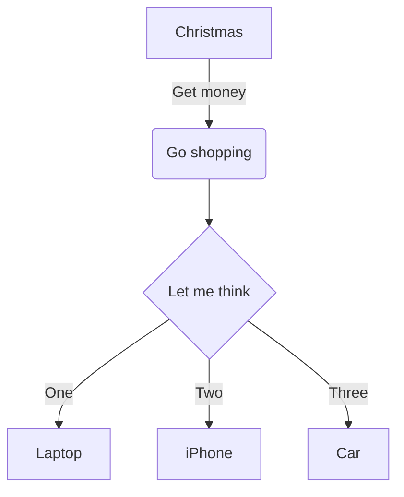

# Hexo Theme Reimu - Content Guide

## Front-matter

Front-matter is a block of YAML or JSON at the beginning of the file that is used to configure settings for your writings. Front-matter is terminated by three dashes when written in YAML or three semicolons when written in JSON.

### YAML
```yaml
---
title: Hello World
date: 2013/7/13 20:46:25
---
```

### JSON
```json
"title": "Hello World",
"date": "2013/7/13 20:46:25"
;;;
```

## Settings

| Setting | Description | Default |
|---------|-------------|---------|
| layout | Layout | post or page |
| title | Title | Filename (posts only) |
| date | Published date | File created date |
| updated | Updated date | File updated date |
| comments | Enables comment feature for the post | true |
| tags | Tags (Not available for pages) | |
| categories | Categories (Not available for pages) | |
| permalink | Overrides the default permalink of the post. Permalink should end with / or .html | |
| excerpt | Page excerpt in plain text. Use this plugin to format the text | |
| disableNunjucks | Disable rendering of Nunjucks tag {{ }}/ and tag plugins when enabled | |
| lang | Set the language to override auto-detection | Inherited from _config.yml |
| published | Whether the post should be published | For posts under _posts, it is true, and for posts under _drafts, it is false |

## Layout

The default layout is `post`.

### Post

The default layout. Files that use this layout will be displayed in the archive.

### Page

The page layout. This layout will not display in the archive.

### Draft

Drafts are posts without a date. They're located in `source/_drafts` folder.

You can use the `publish` command to move drafts to `source/_posts` folder. This command works in a similar way to `new`.

```bash
$ hexo publish [layout] <filename>
```

## Categories & Tags

Only posts support the use of categories and tags.

Categories apply to posts in order, resulting in a hierarchy of classifications and sub-classifications.

Tags are all defined on the same hierarchical level so the order in which they appear is not important.

```yaml
categories:
  - Sports
  - Baseball
tags:
  - Injury
  - Fight
  - Shocking
```

If you want to apply multiple category hierarchies, use a list of names instead of a single name. If Hexo sees any categories defined this way on a post, it will treat each category for that post as its own independent hierarchy.

```yaml
categories:
  - [Sports, Baseball]
  - [MLB, American League, Boston Red Sox]
  - [MLB, American League, New York Yankees]
  - Rivalries
```

## Cover

You can set a cover image for your post or page.

```yaml
---
title: Hello World
cover: /images/cover.jpg
---
```

You can also use a color as the cover:

```yaml
---
title: Hello World
cover: rgb(255, 0, 0)
---
```

Or disable the cover:

```yaml
---
title: Hello World
cover: false
---
```

## Excerpt

You can set an excerpt for your post.

```yaml
---
title: Hello World
excerpt: This is an excerpt.
---
```

Or you can use `<!-- more -->` in your post content to set the excerpt.

```markdown
This is an excerpt.
<!-- more -->
This is the rest of the content.
```

## Thumbnail

You can set a thumbnail for your post.

```yaml
---
title: Hello World
thumbnail: /images/thumbnail.jpg
---
```

## Sidebar

You can customize the sidebar for each post or page.

```yaml
---
title: Hello World
sidebar: left # or right, or false to disable
---
```

## Comment

You can enable or disable comments for each post or page.

```yaml
---
title: Hello World
comments: true # or false
---
```

## Math

Reimu supports mathematical formulas rendering with [KaTeX](https://katex.org/).

Enable math rendering in `_config.yml`:

```yaml
math:
  enable: true
  engine: katex # or mathjax
```

Then enable math in your post:

```yaml
---
title: Hello World
math: true
---
```

### Inline Math

Use `$...$` for inline math:

```markdown
This is an inline formula: $E=mc^2$
```

### Block Math

Use `$$...$$` for block math:

```markdown
$$
\frac{\partial u}{\partial t} = h^2 \left( \frac{\partial^2 u}{\partial x^2} + \frac{\partial^2 u}{\partial y^2} + \frac{\partial^2 u}{\partial z^2}\right)
$$
```

## Mermaid

Reimu supports [Mermaid](https://mermaid-js.github.io/mermaid/) diagrams.

Enable mermaid in `_config.yml`:

```yaml
mermaid:
  enable: true
```

Then use mermaid code blocks:

````markdown

````

## Code Highlighting

### Syntax Highlighting

Reimu supports syntax highlighting with [highlight.js](https://highlightjs.org/).

Configure in `_config.yml`:

```yaml
highlight:
  enable: true
  line_number: true
  auto_detect: false
  tab_replace: '    '
  wrap: true
  hljs: false
```

### Line Numbers

Enable line numbers:

```yaml
highlight:
  line_number: true
```

### Code Block Options

You can add options to code blocks:

````markdown
```javascript [lines:1-10] [highlight:3,5-7] [title:"Example"]
function test() {
  console.log("Hello World");
}
```
````

## Tabs

Create tabbed content:

```markdown

<!-- tab title1 -->
Content 1
<!-- endtab -->

<!-- tab title2 -->
Content 2
<!-- endtab -->

```

## Note/Admonition

Create note blocks:

```markdown

This is an info note



This is a warning note



This is a danger note



This is a success note

```

## Button

Create buttons:

```markdown

```

Example:

```markdown

```

## Label

Create labels:

```markdown

```

Example:

```markdown





```

## Image Gallery

Create an image gallery:

```markdown




```

## Video

Embed videos:

```markdown

```

## Audio

Embed audio:

```markdown

```

## PDF

Embed PDF:

```markdown

```

## Link Card

Create link cards:

```markdown

```

## Timeline

Create timelines:

```markdown


Event 1



Event 2


```

## Spoiler

Create spoiler content:

```markdown

Hidden content

```

## Checkbox

Create checkboxes:

```markdown
 Completed task
 Incomplete task
```

## Text Alignment

Align text:

```markdown

Centered text



Right-aligned text



Left-aligned text

```

## Quotes

Create styled quotes:

```markdown

Quote content

```

## Poetry

Format poetry:

```markdown

Line 1
Line 2
Line 3

```

## Collapse/Accordion

Create collapsible content:

```markdown

Hidden content

```

## Progress Bar

Create progress bars:

```markdown



```

## Tag Cloud

Display tag cloud (in sidebar widget):

```yaml
widgets:
  - tagcloud
```

## Friend Links

Add friend links in `_config.yml`:

```yaml
links:
  - name: Friend 1
    url: https://example1.com
    avatar: /images/avatar1.jpg
    description: Description 1
  - name: Friend 2
    url: https://example2.com
    avatar: /images/avatar2.jpg
    description: Description 2
```

## Archive

Archives are automatically generated by Hexo at `/archives/`.

## Search

Enable search in `_config.yml`:

```yaml
algolia_search:
  enable: true
  hits:
    per_page: 10

# or

generator_search:
  enable: true
```

## RSS

Enable RSS in `_config.yml`:

```yaml
rss: /atom.xml
```

Install the RSS plugin:

```bash
npm install hexo-generator-feed --save
```

## Sitemap

Generate sitemap:

```bash
npm install hexo-generator-sitemap --save
```

Configure in `_config.yml`:

```yaml
sitemap:
  path: sitemap.xml
```

## 404 Page

Create a 404 page at `source/404.md`:

```yaml
---
layout: page
title: 404 Not Found
permalink: /404.html
---

Page not found!
```

## Custom CSS/JS

Add custom CSS in `source/css/custom.styl` or custom JS in `source/js/custom.js`.

## Encryption

Encrypt posts with password protection:

```yaml
---
title: Protected Post
password: your_password
---
```

Install the encryption plugin:

```bash
npm install hexo-blog-encrypt --save
```
````